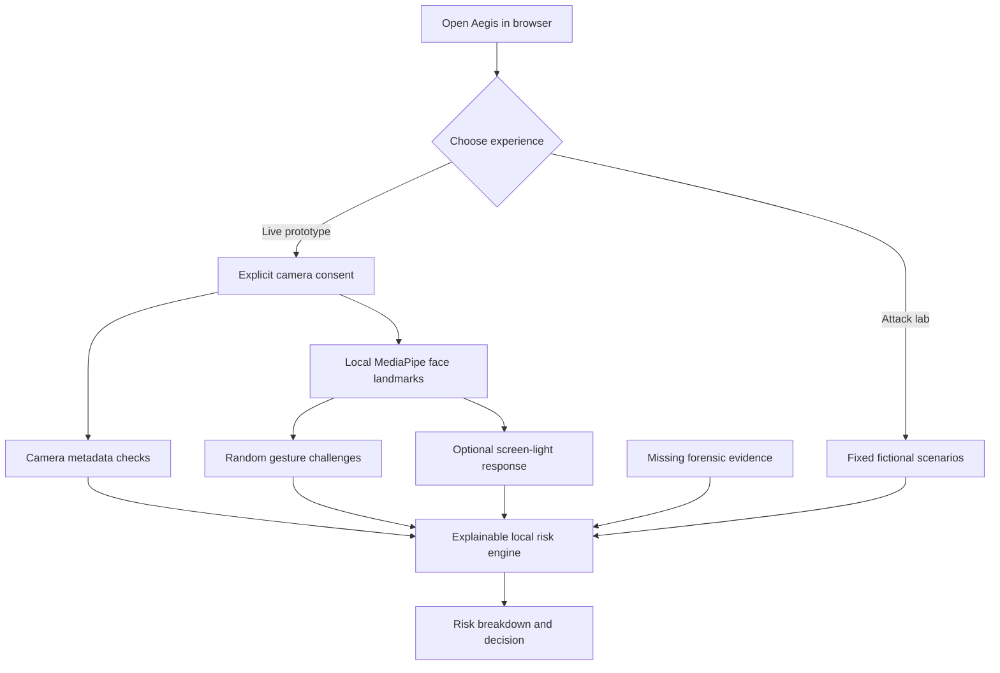

<div align="center">

# 🛡️ AEGIS PRESENCE

### Trust the person. Not just the pixels.

**A privacy-conscious, browser-based prototype exploring layered liveness checks and explainable video-verification risk.**

[](https://aegis-presence-inky.vercel.app)
[](https://nextjs.org/)
[](https://www.typescriptlang.org/)
[](LICENSE)

**[Try the demo](https://aegis-presence-inky.vercel.app)** · **[Explore attack lab](https://aegis-presence-inky.vercel.app/verify/?mode=lab)** · **[Deployment guide](DEPLOYMENT.md)**

</div>

> **Hackathon prototype — not a production identity-verification service.** Camera and liveness checks are experimental heuristics; deepfake-artifact and audio-visual scores are simulated. Live verification deliberately cannot approve a user.

## 🚨 The challenge

A convincing face on a screen is not proof that a real person is present. Replayed footage, virtual-camera feeds, and AI-generated video complicate remote verification. **Aegis Presence** explores a different question: *What evidence can a browser gather, and how clearly can it explain what remains uncertain?*

## ✨ What Aegis demonstrates

| Layer | Demo capability | Reality check |
| --- | --- | --- |
| 📷 Camera integrity | Reads browser-exposed camera metadata and frame cadence | Spoofable signals; not hardware attestation |
| 👁️ Active liveness | Random head turn, two blinks, and a four-digit mouth-movement prompt using MediaPipe | Does **not** recognize spoken digits or certify liveness |
| 🌈 Screen-light response | Optional six-step color stimulus and cheek-color sampling | Experimental; affected by lighting, exposure, and movement |
| 🧩 Deepfake artifacts | Explains how a forensic signal would affect risk | **Simulated**; no forensic model runs |
| 🔊 Audio-visual sync | Shows a hypothetical synchronization signal | **Simulated**; no microphone or speech recognition |
| ⚖️ Explainable risk | Weighted local score, provenance, missing-evidence handling | Illustrative policy, **not** a fraud probability |
| 🧪 Attack lab | Four fixed scenarios demonstrating approve / step-up / reject | Fictional fixtures, **not** measured detection results |

## 🎬 Experience the demo

1. **Open the [live app](https://aegis-presence-inky.vercel.app)** and review the overview.
2. **Try verification** at `/verify/`: grant camera permission if comfortable, then follow or skip randomized challenges.
3. **Review the result**: see available signals, missing evidence, and the reasoning behind the illustrative outcome.
4. **Explore the [attack lab](https://aegis-presence-inky.vercel.app/verify/?mode=lab)** without camera access.
5. **Visit `/admin/`** for a searchable dashboard of fictional attempts (not real users).

**Privacy first:** Camera inference runs locally in the browser. The application does not request microphone access, upload biometric video, create user accounts, or persist verification sessions. Hosting providers may still collect ordinary request logs.

## 🏗️ How it works



The site is a **static Next.js application**. It has no application backend or API-based identity-verification service. The model and MediaPipe WASM assets are prepared during setup and served from the same origin. Browser-generated risk values are not tamper-proof authorization decisions.

## 🧠 Risk scoring — transparent by design

Aegis combines five inputs using fixed weights:

| Signal | Weight |
| --- | ---: |
| Active liveness | 30% |
| Camera integrity | 20% |
| Deepfake artifacts | 20% |
| Screen-light response | 15% |
| Audio-visual synchronization | 15% |

`risk = Σ(weight × usedRisk / 100)`

Missing, invalid, excluded, or duplicate evidence contributes **60/100 at its original weight**, rather than being ignored. Simulated forensic scores cannot improve a live decision.

In the **attack lab**, the illustrative policy uses these thresholds: **approve < 30**, **step-up 30 to < 65**, **reject ≥ 65**, subject to additional coverage and camera-risk conditions. In **live mode, approval is disabled**. A live rejection also requires multiple high-risk usable signals and sufficient evidence; otherwise the result is step-up.

> These weights and thresholds are design choices, not scientifically calibrated fraud probabilities.

## 🧪 Attack lab scenarios

| Scenario | Illustrative risk | Demo outcome |
| --- | ---: | --- |
| Normal user | 7/100 | Approve |
| Replayed video | 73/100 | Reject |
| Virtual-camera feed | 31/100 | Step-up |
| Deepfake sample | 67/100 | Reject |

All four are **deterministic fictional fixtures**. The lab does not analyze a real attack video or measure detection accuracy.

## 🛠️ Built with

- **Next.js + React + TypeScript** — responsive interface and client-side experience
- **MediaPipe Face Landmarker** — local facial landmarks and expression signals
- **Browser Camera API** — permission-based webcam capture
- **Playwright** — browser workflow testing
- **Vercel** — static deployment

## 🚀 Run locally

**Prerequisites:** Node.js **24 LTS**, npm, and a current desktop Chrome browser for the first webcam test. Other browsers and mobile devices need separate verification.

```bash
git clone https://github.com/amnnsh/aegis-presence.git
cd aegis-presence
npm install
npm run dev
```

Open **http://localhost:3000**.

The install process prepares MediaPipe WASM and downloads a versioned face-landmark model. If asset preparation warns or fails, retry with:

```bash
npm run assets
```

On Windows PowerShell, if `npm.ps1` is blocked by execution policy, run `npm.cmd install` and `npm.cmd run dev` instead.

**Useful checks:**

```bash
npm run typecheck
npm test
npm run build
npm run start
```

`npm run start` previews the static production export at `http://localhost:3000`; stop the development server first. For browser tests after a successful build:

```bash
npx playwright install chromium
npm run test:browser
```

For deployment, authentication, troubleshooting, and release checks, see **[DEPLOYMENT.md](DEPLOYMENT.md)** and **[docs/QA_REPORT.md](docs/QA_REPORT.md)**. Do not claim that tests passed until they run successfully in your environment.

## 🗂️ Repository guide

```text
app/                    Next.js routes and styles
components/             Verification UI, results, dashboard
lib/vision.ts           Local camera/model lifecycle
lib/challenges.ts       Random prompts and gesture logic
lib/injection.ts        Camera metadata heuristics
lib/reflection.ts       Optional color-response experiment
lib/risk.ts             Weighted policy and missing evidence
lib/scenarios.ts        Simulated attack fixtures
tests/                  Unit and browser tests
scripts/                Assets and static preview
DEPLOYMENT.md           Deployment walkthrough
docs/DEMO_SCRIPT.md     Two-minute presentation
docs/PITCH.md           Project pitch
docs/QA_REPORT.md       Test evidence and release gaps
```

## 🔐 Responsible design and limitations

- **No identity assertion:** Matching an enrolled person's identity is outside this prototype.
- **No production security boundary:** Client-side code and scores can be modified by an attacker.
- **No validated spoof-detection performance:** Camera, gesture, and color heuristics share limitations and may fail on legitimate users.
- **No real forensic models:** Deepfake-artifact and audio-visual synchronization values are demonstrations only.
- **No real admin telemetry:** Dashboard records are fictional; live sessions are not saved there.
- **Accessible alternatives matter:** Challenges can be skipped; skipping adds uncertainty rather than silently passing or proving fraud.

## 🗺️ Roadmap

- [ ] Evaluate real deepfake-detection models on documented datasets
- [ ] Validate false-accept and false-reject rates across devices and conditions
- [ ] Add secure server-issued, expiring challenges and replay protection
- [ ] Build accessible step-up and human-review workflows
- [ ] Test camera performance on real phones and multiple browsers
- [ ] Develop a deliberate privacy, retention, and threat-modeling plan

## 📚 Documentation and references

**Project documents:** [Deployment](DEPLOYMENT.md) · [Demo script](docs/DEMO_SCRIPT.md) · [Pitch](docs/PITCH.md) · [Build plan](docs/BUILD_PLAN_24H.md) · [QA report](docs/QA_REPORT.md) · [Third-party notices](THIRD_PARTY.md)

**Technical references:** [MediaPipe Face Landmarker](https://ai.google.dev/edge/mediapipe/solutions/vision/face_landmarker/web_js) · [MDN getUserMedia](https://developer.mozilla.org/en-US/docs/Web/API/MediaDevices/getUserMedia) · [Next.js](https://nextjs.org/docs/app/getting-started/installation)

**Context sources:** [Entrust identity fraud report announcement (2025)](https://www.entrust.com/company/newsroom/deepfakes-social-engineering-and-injection-attacks-on-the-rise) · [Pindrop enterprise survey (2026)](https://www.pindrop.com/company-news/deepfakes-are-hitting-the-enterprise-but-90-lack-purpose-built-defenses) · [Gartner forecast (2024)](https://www.gartner.com/en/newsroom/press-releases/2024-02-01-gartner-predicts-30-percent-of-enterprises-will-consider-identity-verification-and-authentication-solutions-unreliable-in-isolation-due-to-deepfakes-by-2026)

## 🤝 Contributors and license

Built as a hackathon prototype. See the repository's commit history for contributors and attribution. Project code is MIT-licensed; third-party libraries and model assets have their own terms. Review [THIRD_PARTY.md](THIRD_PARTY.md) before redistribution.

<div align="center">

### 🛡️ AEGIS PRESENCE
**Trust the person. Not just the pixels.**

[Back to top](#️-aegis-presence)

</div>
