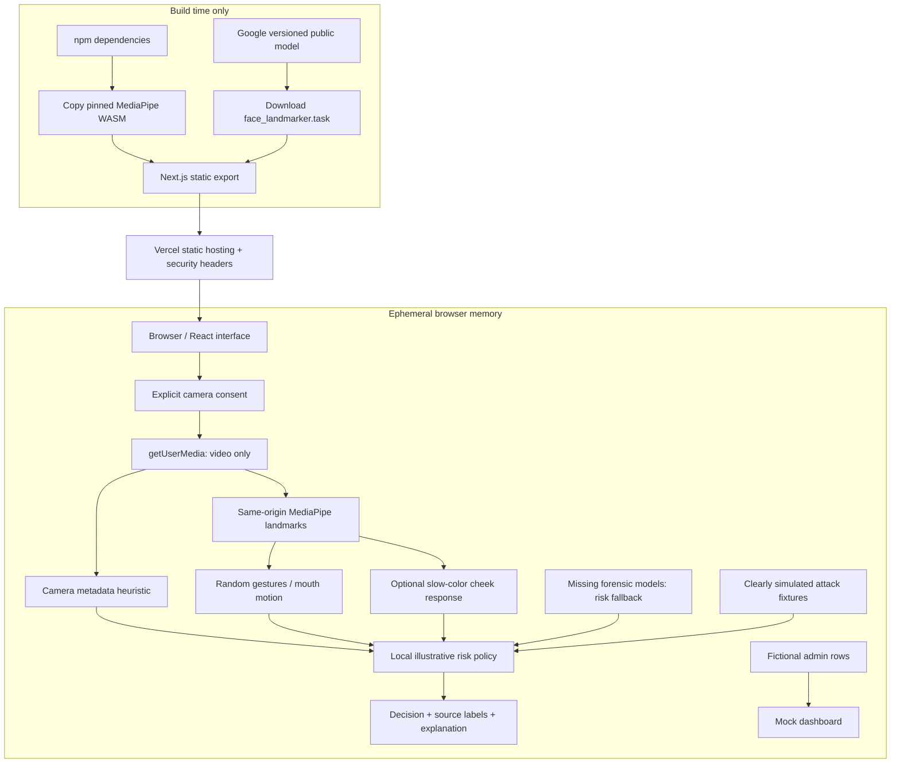

# Assumptions

1. This is a hackathon **frontend prototype**, not a deployable identity-verification or access-control service. Aegis is a working name; no trademark clearance is claimed.
2. The unspecified operating system and repository owner are handled in `DEPLOYMENT.md` with Windows, macOS, Linux, personal-account, and organization paths. No paid service or existing account is assumed.
3. Use Node.js **24 LTS**, npm, and a current desktop Chrome browser for the first webcam rehearsal. Node 22.16 was available for the checks performed here. Other browsers and physical phones need verification.
4. No backend, accounts, identity documents, microphone, analytics SDK, biometric upload, or persistent session storage is included. Ordinary hosting request logs are outside this application's in-memory processing.
5. Camera metadata, gestures, and color response are **unvalidated heuristics**. Deepfake and audio-visual scores are **simulated**. All four attack scenarios and all dashboard rows are fictional fixtures.
6. A live session intentionally **cannot approve**. Speech recognition and both forensic models are missing. Missing evidence routes to step-up rather than silently passing; the attack lab demonstrates all three decisions.
7. The three problem statistics are attributed, differently scoped external findings, not Aegis performance measurements. Gartner's statement is a **2024 forecast**, not proof of what happened in 2026.
8. The build needs internet access to install npm packages and download Google's versioned face-landmark model. Runtime inference uses assets hosted on the same origin. No API keys or environment variables are required.
9. The source and documentation are supplied, but a complete Next.js installation/build, physical-webcam test, and Vercel deployment were **not executable in the authoring environment**. Dependency downloads were blocked. See the exact test record in `docs/QA_REPORT.md`; run the release checks before submission.

# Aegis | Presence, not just appearance

**Trust the person. Not just the pixels.**

A layered, browser-only verification interface that treats a plausible-looking video feed as insufficient evidence. It gathers limited local signals, reveals what is missing, and explains an illustrative risk decision.

**Live Vercel URL:** https://YOUR-PROJECT.vercel.app _(placeholder; replace after deployment)_  
**Repository:** https://github.com/YOUR-OWNER/aegis-presence _(placeholder; replace after creating the repo)_

## Start here

Extract the project and open a terminal inside the directory containing `package.json`:

```sh
npm install
npm run dev
```

Open **http://localhost:3000**. The install script copies MediaPipe WASM and downloads the face-landmark model. It prints a warning rather than breaking installation if that download fails; retry with `npm run assets`. The attack lab works without camera permission or a model. A production build requires the assets.

On Windows PowerShell versions that do not support `&&`, use the two commands on separate lines, as above. On other shells, `npm install && npm run dev` is equivalent.

**Deployment commands, clicks, authentication, teamwork, and recovery:** [DEPLOYMENT.md](DEPLOYMENT.md).

## The problem

Deepfakes challenge an identity check's assumption that the camera shows a live, present person. The landing page includes three attributed statistics:

| Finding | Source and scope |
| --- | --- |
| Digital injection attacks increased **40% year over year**. | Entrust's 2026 Identity Fraud Report announcement, published November 18, 2025; its identity-verification data covers September 2024-September 2025. This is not a universal market-wide rate. [1] |
| **74%** of surveyed security leaders encountered or suspected a deepfake attack in the previous year. | Pindrop, September 28, 2026, surveying 250 US security leaders at large enterprises. This describes that survey population. [2] |
| By 2026, **30%** of enterprises would consider identity-verification/authentication solutions unreliable in isolation because of deepfakes. | Gartner forecast published February 1, 2024. A prediction, not an observed 2026 outcome. [3] |

The figures use different populations and methods. Do not combine them into a single benchmark, claim causation, or describe them as Aegis accuracy.

## The solution and demo flow

**Overview (`/`) -> Verification (`/verify/`) -> local challenges -> explainable result.** The mock activity dashboard is `/admin/`. Open `/verify/?mode=lab` for the camera-free attack demonstration.

Live verification begins with explicit consent. Camera metadata is inspected, a local MediaPipe model loads, and three prompts appear in a cryptographically shuffled order: a randomly directed head turn, two blinks, and four random digits. The digits check observes mouth movement only; it does not recognize the spoken digits. Each challenge can be skipped. Optional slow screen colors are disabled by default and require separate consent.

Results show five risk indices, their provenance, fixed weights, excluded inputs, and a plain-language explanation. Closing the session stops the camera. Navigation, a hidden tab, a cancelled permission request, and a camera interruption also discard the active capture session. Reloading loses session results.

The attack panel does **not** execute an attack, play a sample, or analyze a deepfake. It demonstrates the decision policy using fixed illustrative inputs:

| Fixture | Risk index | Decision | Intended explanation |
| --- | ---: | --- | --- |
| Normal user | 7/100 | Approve | Low-risk synthetic inputs; not an identity assertion. |
| Replayed video | 73/100 | Reject | High fixture liveness and light-response risks. |
| Virtual-camera feed | 31/100 | Step-up | Ambiguous source; virtual cameras can also be legitimate. |
| Deepfake sample | 67/100 | Reject | High simulated artifact and synchronization risks. |

These are deterministic demo outcomes, **not measured detection results**.

## What is real, simplified, or simulated?

| Layer | Implemented behavior | Important limitation |
| --- | --- | --- |
| Camera integrity | Reads permitted track label, width/height, reported frame rate, and observed presented-frame cadence when supported. Flags virtual-camera keywords and coarse anomalies. | Metadata is spoofable. No hardware attestation, injection interception, or reliable virtual-camera detection. Legitimate low-end or virtual cameras may be flagged. |
| Active liveness | MediaPipe face landmarks and blendshapes run locally; single-face gating, baseline-relative head motion, two open/closed/reopened blink cycles, random prompt order/direction/digits. | Not presentation-attack detection certification. No speech recognition. Mouth cycles are partial evidence, never a correct-digit check. Camera-derived signals share failure modes. |
| Screen-light response | Six randomized slow color plateaus of 1.8 seconds; coarse cheek RGB samples are compared to the stimulus after settling. | Unvalidated correlation, affected by exposure, lighting, skin appearance, movement, and display brightness. Adaptive attacks can fake it. Weak or incomplete response is unavailable. Skip is always supported. |
| Deepfake artifact risk | Example value shown with **"simulated, real model in the full build"** labeling. | No deepfake model runs. The value cannot improve a live decision. |
| Audio-visual synchronization | Example value with the same simulated label. | No microphone permission, audio, transcription, or synchronization analysis. Browser speech services are deliberately not used. |
| Risk engine | Deterministic local code, fixed weights, explicit missing-evidence policy, auditable contributions. | Illustrative, uncalibrated, client-tamperable, not an authorization boundary. |
| Admin activity | Searchable/filterable fictional attempts with inspectable fixture decisions. | Not authenticated and not connected to live sessions; never put real customer data here. |

## Architecture



There is **no API route or application backend**. `scripts/serve.mjs` is only a local static-file preview server for the exported build. Hosting sends application/model assets to the browser; the app has no path that sends webcam frames back. Face inference runs on the main thread at a throttled target of 10 analyses per second; production work should evaluate a worker and device-specific performance.

## Risk policy, not a fraud probability

For the five inputs, `risk = sum(weight * usedRisk / 100)`:

- Camera integrity: **20%**; active liveness: **30%**; light response: **15%**; artifacts: **20%**; audio-visual sync: **15%**.
- Missing, invalid, duplicate, or excluded input: **60/100 at its original weight**. We do not remove its weight and renormalize toward approval. Simulated model scores are excluded from live decisions.
- Fixture thresholds: **approve <30**, **step-up 30 to <65**, **reject >=65**. Comparisons use the unrounded score. Camera risk >=70 or incomplete usable coverage prevents approval.
- Live mode: **never approve**. A live reject additionally requires total risk >=65, at least two usable local inputs >=70, and at least 50/100 usable weight. Otherwise step-up. A skipped gesture, denied camera, or absent face is not alone proof of fraud.

The weights and thresholds are design choices, not estimates derived from a validation dataset. "Coverage" means available policy weight, not confidence. Layering is only meaningfully stronger when failure modes are understood and complementary evidence is validated; these three camera-derived heuristics are not proven independent.

## Privacy and security boundaries

The application does not request audio, record media, use localStorage/IndexedDB, create accounts, or upload biometric data. Temporary canvas samples are cleared and only numerical aggregates are used for the current result. It keeps the visible result in React memory until reset/navigation; no live attempt is added to the mock dashboard. The host may still retain ordinary technical request logs such as IP address and user agent. This prototype is not a compliance certification.

All inference assets are same-origin. Vercel and the local static preview apply a restrictive content-security policy, deny framing, disable microphone/geolocation, and allow camera only for this origin. The prototype permits inline framework scripts/styles and WASM execution; a future dynamic backend can evaluate nonce/hash-based CSP. Next development/build telemetry is disabled by `scripts/next.mjs`. Do not add hosting analytics or replay integrations during deployment.

The browser cannot securely prove that its own scores or stream are authentic. A real service needs server-generated expiring challenges, replay controls, signed server decisions, abuse controls, authentication/authorization, validated models, and a deliberate data-retention design. A passkey can prove control of a credential; it does not independently identify the human holding it.

For accessibility, no one is forced to blink, turn their head, speak, or watch changing colors. Skips produce uncertainty and a proposed alternative, not a fake pass. Human-assisted or other accessible step-up is future scope. The optional colors are slow, but this is **not a claim that they are safe for every user**.

## Development and release checks

```sh
npm run assets
npm run typecheck
npm test
npm run build
npm run start
```

`npm run start` previews `out/` at http://localhost:3000 with production security headers. Stop the development server first with `Ctrl+C`. To use another port: `npm run dev -- --port 3001` or `npm run start -- --port 3001`.

Optional real-export browser checks, after a successful build:

```sh
npx playwright install chromium
npm run test:browser
```

CI installs Linux browser dependencies and checks the build plus desktop/mobile Chromium flows. Camera hardware, head gestures, reflections, Safari, Firefox, and real phones still need a manual rehearsal. Do not call tests green until your actual dependency-aware build and workflow pass.

No fabricated `package-lock.json` is included. The first successful `npm install` creates it: review and commit it. Subsequent clean installs should use `npm ci`. Run `npm audit`, investigate findings, and update deliberately; do not use `npm audit fix --force` without reviewing changes. The first package installation may resolve newer allowed development dependencies.

**Checks actually performed here:** 29 unit tests passed; strict TypeScript checks passed for the six pure core modules; an isolated rendering harness exercised the actual component source and responsive layouts. That harness used an available older React runtime, **not a Next.js/React 19 build**. Full details and remaining release gates: [QA report](docs/QA_REPORT.md).

## Project map

```text
app/                         Static Next.js pages, metadata, global styles
components/                  Landing, verification, result UI, mock dashboard
lib/vision.ts                Local camera/model ownership and cleanup
lib/challenges.ts            Random prompts and gesture state machines
lib/injection.ts             Coarse metadata heuristics
lib/reflection.ts            Slow stimulus and cheek-color correlation
lib/risk.ts                  Fixed policy and missing-evidence handling
lib/scenarios.ts             Explicit simulated fixtures and mock attempts
scripts/                     Asset preparation, telemetry wrapper, static preview
public/models/               Generated model (gitignored), provenance notes
public/mediapipe/             Generated WASM (gitignored), provenance notes
tests/                       Unit tests and real-export Playwright checks
.github/workflows/ci.yml      Type-check, test, build, browser checks
DEPLOYMENT.md                Separate 10-step deployment checklist
docs/DEMO_SCRIPT.md           Two-minute presentation
docs/PITCH.md + PITCH.pdf     Editable pitch and one-page printable PDF
docs/BUILD_PLAN_24H.md        Prioritized next-24-hours roadmap
docs/QA_REPORT.md             Executed checks versus unverified release gates
```

## Sources and acknowledgments

[1] Entrust, November 18, 2025: https://www.entrust.com/company/newsroom/deepfakes-social-engineering-and-injection-attacks-on-the-rise  
[2] Pindrop, September 28, 2026: https://www.pindrop.com/company-news/deepfakes-are-hitting-the-enterprise-but-90-lack-purpose-built-defenses  
[3] Gartner, February 1, 2024: https://www.gartner.com/en/newsroom/press-releases/2024-02-01-gartner-predicts-30-percent-of-enterprises-will-consider-identity-verification-and-authentication-solutions-unreliable-in-isolation-due-to-deepfakes-by-2026  
[4] MediaPipe Face Landmarker for web: https://ai.google.dev/edge/mediapipe/solutions/vision/face_landmarker/web_js  
[5] Camera secure-context and permission requirements: https://developer.mozilla.org/en-US/docs/Web/API/MediaDevices/getUserMedia  
[6] Next.js setup: https://nextjs.org/docs/app/getting-started/installation

Project code: MIT. Third-party dependencies and model assets retain their own terms; review [THIRD_PARTY.md](THIRD_PARTY.md) before redistribution or production use.
